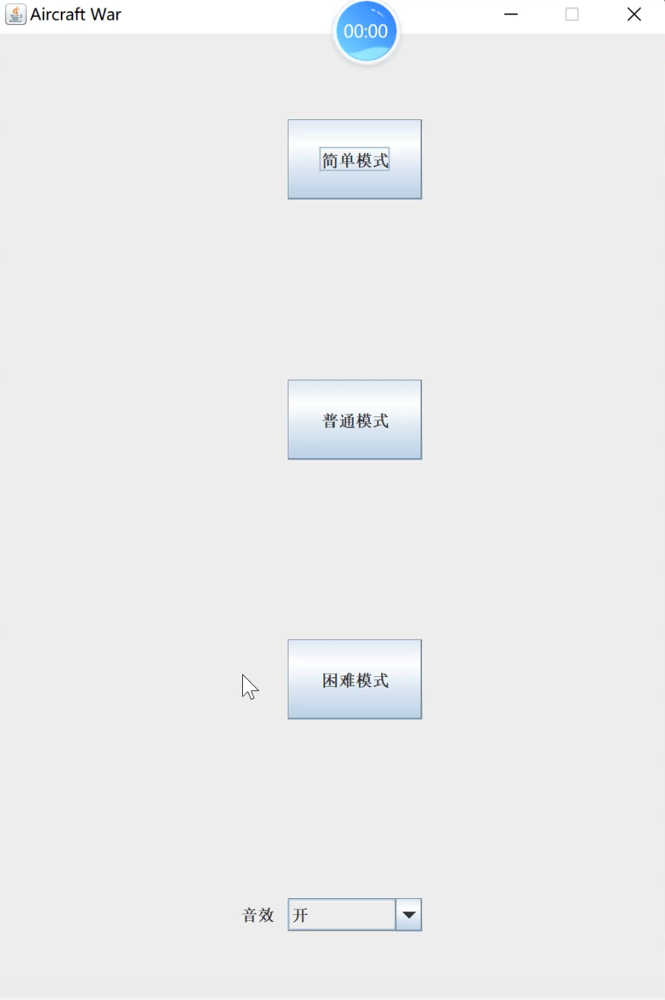
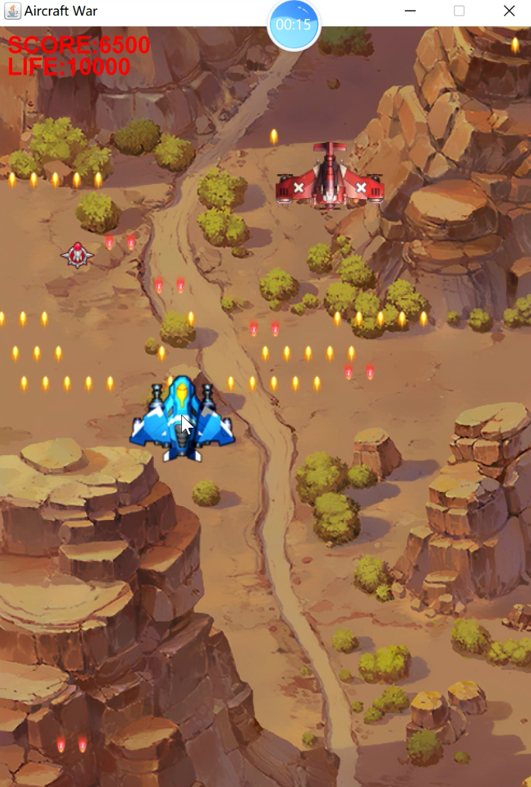
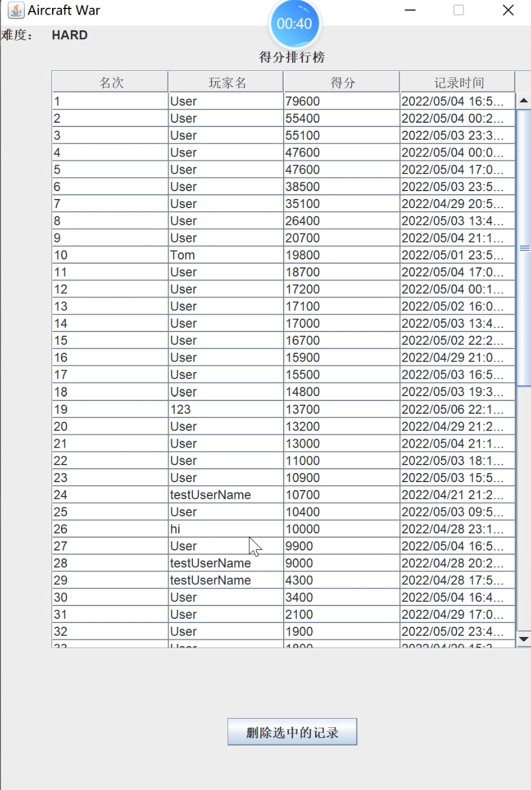

# 2022_HITSZ_IOSC-Labs

**AircraftWar-base**，飞机大战游戏系统的设计与实现

哈尔滨工业大学（深圳）2022年春季学期《面向对象的软件构造导论》课程实验

## 项目简介

### 背景介绍

2022年春季学期，哈尔滨工业大学（深圳）首次开设《面向对象的软件构造导论》课程。这一课程总学时为40（其中实验学时为16），以Java语言为基础，以典型的面向对象软件构造案例为实践载体，讲授面向对象的基本概念和基本原理、Java语言基础及面向对象的软件构造方法、Java常用类库及设计模式、面向对象软件的代码测试和质量保障等。

在实验部分，这门课程要求学生综合运用Java语言、面向对象思想、设计模式等知识，设计一个飞机大战游戏系统。课程刚开始时，教师会提供一套具有基础功能的框架代码，然后通过六次实验引导学生不断完善前一阶段的工作，逐渐实现一个功能相对复杂的飞机大战游戏软件。

作者这门课程的最终总成绩为**97分（排名3/140）**，其中实验部分的得分为**39.7分（满分40分）**。本项目包含了作者在完成这一实验过程中所产生的代码与文档。代码参考**实验环境**部分添加至IDEA工程中，可以直接运行。

### 六次实验内容安排

| 实验次数 | 学时分配 | 实验内容                                                    |
|------|------|---------------------------------------------------------|
| 1    | 2    | 功能分析；添加其它类型的敌机以及三种道具                                    |
| 2    | 2    | 无功能新增；使用单例模式和工厂方法模式重构第1次实验的代码                           |
| 3    | 2    | 无功能新增；使用JUnit5进行单元测试，并使用阿里编码规约插件修改代码中的不规范之处             |
| 4    | 4    | 使用策略模式实现不同弹道的射击方式、火力道具的加成效果，并使用数据访问对象模式实现游戏数据存储、得分排行榜显示 |
| 5    | 2    | 使用Swing完善图形用户界面，并使用多线程完善火力道具功能、实现游戏音效                   |
| 6    | 4    | 使用观察者模式实现炸弹道具的功能，并使用模板模式实现三种游戏难度                        |

### 实验环境

- 操作系统：Windows 11
- 集成开发环境：IntelliJ IDEA 2021.3.3 (Ultimate Edition)
- 图形用户界面：Swing
- JDK版本：11.0.12
- 插件及依赖库：PlantUML integration，Alibaba Java Coding Guidelines，JUnit5

## 根目录下主要文件说明

- AircraftWar-base
  - data：存放游戏记录文件的目录
  - src：工程源代码目录
  - test：工程测试代码目录
  - uml：存放uml类图的目录
  - .gitignore：git忽略文件
  - AircraftWar-base.iml：IDEA配置文件

- .gitattributes：git配置文件
- LICENSE：MIT开源许可证
- README.md：本文档
- report.pdf：实验报告

## 效果展示

